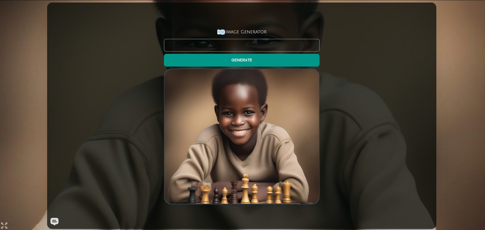

# AI-ImageGenerator
This is a React project that uses the stable diffusion API to produce pictures from text prompts. The style was done with Material UI and Tailwind. The project was hosted on Render with the URL:
https://myaigen55.onrender.com/

